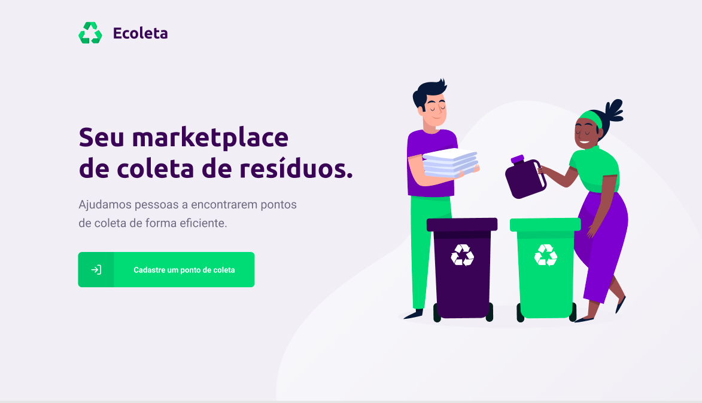
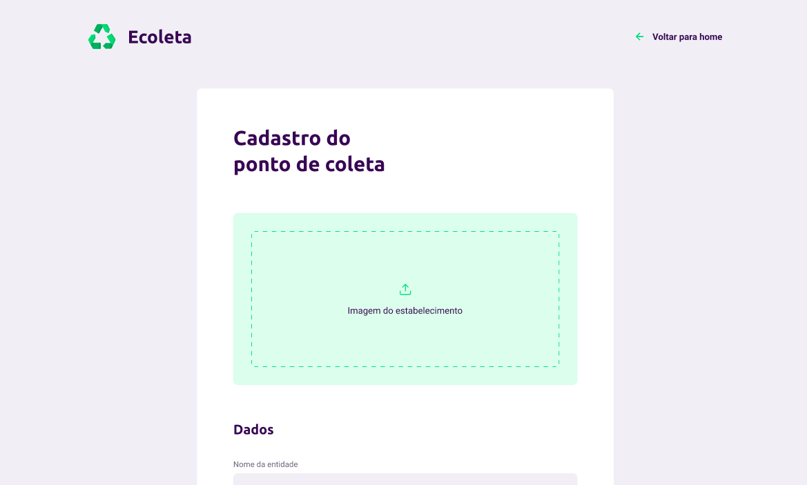
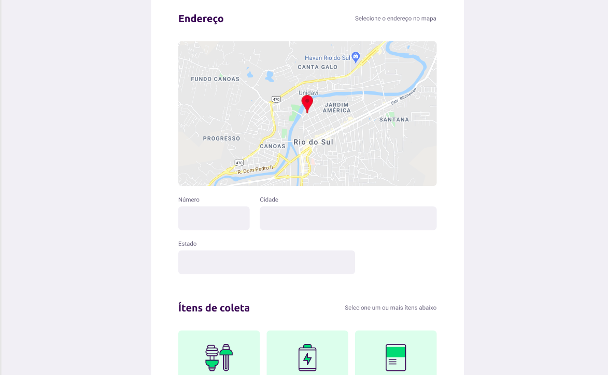
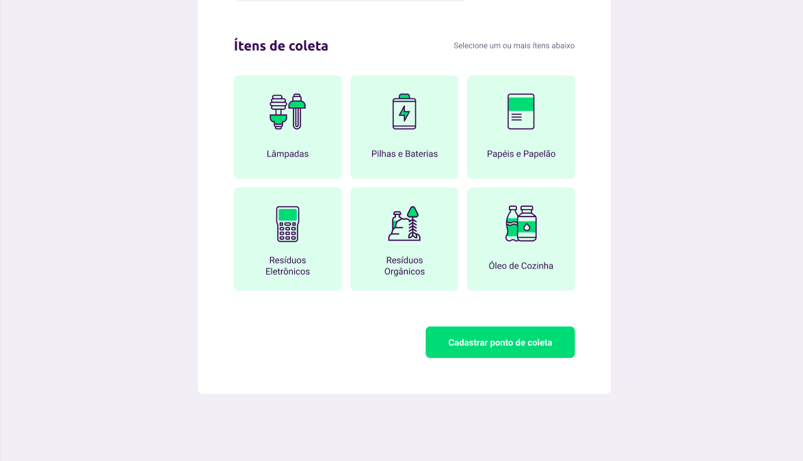
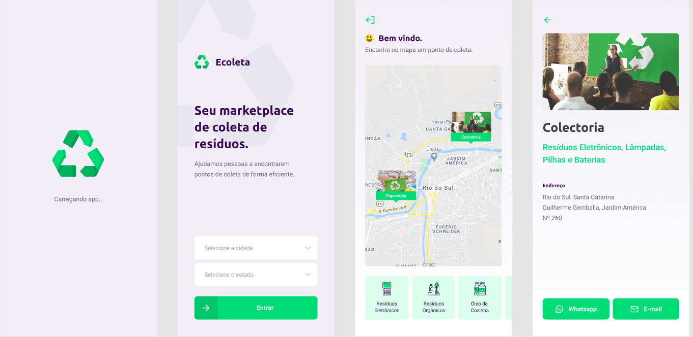

# Ecoleta - Marketplace de coleta de resíduos
### Aplicação desenvolvida na Next Level Week, da Rocketseat

##### Trata-se de uma plicação onde as pessoas podem localizar pontos de coleta de resíduos para reciclagem, na sua cidade, ou de onde estiver. 
##### Funciona da seguinte forma, a pessoa entra no aplcativo, busca por estado, cidade e tipos de resíduos que quer entregar, o aplicativo lista no mapa todas as unidades que recebem os resíduos pesquisados. 
##### Os pontos de coleta que queiram se cadastrar, apenas tem que entrar na aplicação web, preencher o formulário com algumas informações básicas, e pronto, ta feito o cadastro.

## Tecnologias ultilizadas
### Back-end
##### Para desenvolver o back-end foi utilizado Nodejs, com banco de dados SQLite. Foi utilizado knex.js, um query builder para Nodejs, que é capaz de conectar com vários bancos de dados. Com ele obtemos controle de fluxo assíncrono, respostas padronizadas entre diferentes brancos. Conta tabém com um sistema de migrations. Além disso, foi utilizado express e multer para uploads de imagens
### Web 
##### Para desenvolver a aplicaçaõ web, foi tulizado React js, axios, para fazer as solicitações para a API.

### Mobile
##### A versão para mobile, foi construído com React Native, e Expo, para implantar e iterar rapidamente em aplicativos nativos do Android, iOS. Na página de detalhes do ponto, foi adicionado um link que abre direto o email do celular ja com assunto e email da instituição preeenchidos, e outro botão para whatsapp, que tem a mesma função so que para whatsapp.

#### O mais interessnate disso tudo foi que a plicação foi inteiramente feita com TypeScript, que é uma ferramenta que adiciona tipagem estática ao JavaScript que por padrão é uma linguagem que possui tipagem dinâmica.